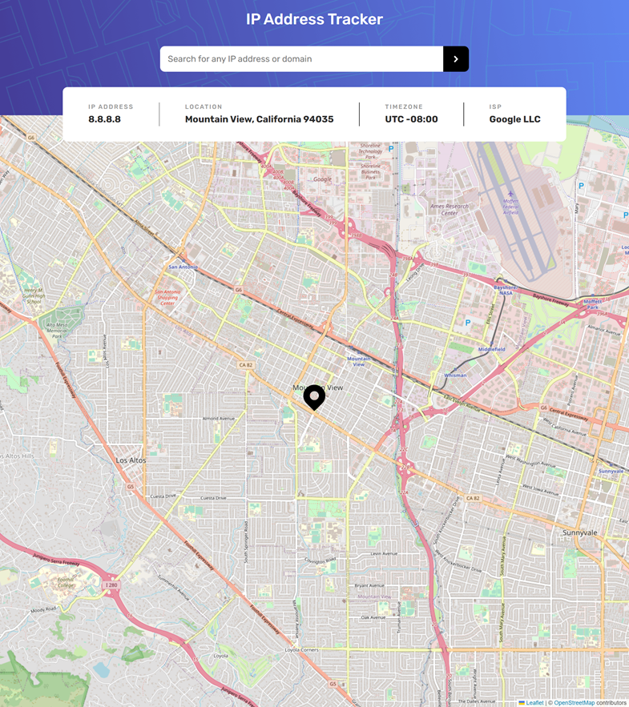

# Frontend Mentor - IP address tracker solution

This is a solution to the [IP address tracker challenge on Frontend Mentor](https://www.frontendmentor.io/challenges/ip-address-tracker-I8-0yYAH0). Frontend Mentor challenges help you improve your coding skills by building realistic projects. 

## Table of contents

- [Overview](#overview)
  - [The challenge](#the-challenge)
  - [Screenshot](#screenshot)
  - [Links](#links)
- [My process](#my-process)
  - [Built with](#built-with)
  - [What I learned](#what-i-learned)
  - [Continued development](#continued-development)
- [Author](#author)

## Overview

### The challenge

Users should be able to:

- View the optimal layout for each page depending on their device's screen size
- See hover states for all interactive elements on the page
- See their own IP address on the map on the initial page load
- Search for any IP addresses or domains and see the key information and location

### Screenshot

### Links

- Solution URL: [https://github.com/kamiliano1/IP-address-tracker](https://github.com/kamiliano1/IP-address-tracker)
- Live Site URL: [https://sprightly-pika-86004b.netlify.app](https://sprightly-pika-86004b.netlify.app) Adblock might block IP API

## My process

### Built with

- Semantic HTML5 markup
- CSS custom properties
- Flexbox
- Mobile-first workflow
- [React](https://reactjs.org/) - JS library
- [Next.js](https://nextjs.org/) - React framework
- [Geolocation API](https://geo.ipify.org/) - IP Geolocation API
- [Leaflet](https://leafletjs.com/) - Leaflet API for the map
- [React Leaflet](https://react-leaflet.js.org/) - React Leaflet

### What I learned

I've learned how to work with Leaflet API and how to integrate it with geolocation API.

### Continued development

The project might be extended by remembering previous IP searches and showing all of them on the map.
Deleting a record on clicking on the map pin.

## Author

- Website - [Kamil Szymon](https://github.com/kamiliano1)
- Frontend Mentor - [@kamiliano1](https://www.frontendmentor.io/profile/kamiliano1)
